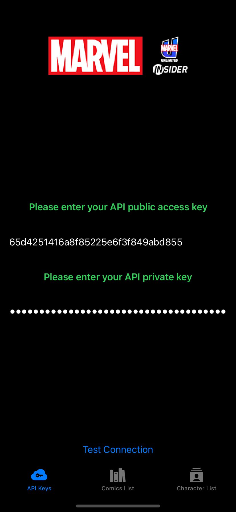

# Sample Marvel API implementation using Swift

---

Hey there, thanks for checking out this repo. Over the last couple of days, i've been using the Marvel API and having fun returning information on Comics  and Characters. 

## Getting Started

This project is written in Swift + SwiftUI and has been tested using Xcode and Swift Playgrounds. Running it should be as easy as opening the project and Xcode and clicking run!

## Main Features

- Can search comics by id, year or title
- Dynamic API implementation makes it easy to extend to other API resources
- UI + Unit test included
- No 3rd party libraries
- Add your keys right in the app!

---

## Login Screen for the API Credentials

### Keys not entered

  
Click to expand!

### Keys entered

  
Click to expand!

### Test the Keys

  
Click to expand!

## Comic List 

### Filter by Comic Title

  
Click to expand!

### Filter by ID

  
Click to expand!

### Filter by year

  
Click to expand!

### Comic Detail View

  
Click to expand!

## Character List

  
Click to expand!

## Works with MacOS

  
Click to expand!

